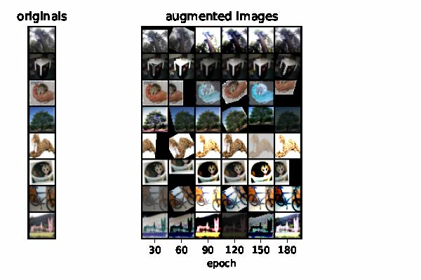

# Adaptive AutoAugment

- Adaptive AutoAugment searches the optimal augmentation policy at each image.
- Adaptive AutoAugment consumes the least computational cost.

## Result Examples
- Images from CIFAR-100

- Used Augmentation Distribution

## Run

- python 3.6
- pytorch 1.7.0, torchvision 0.8.1, cuda10/11
